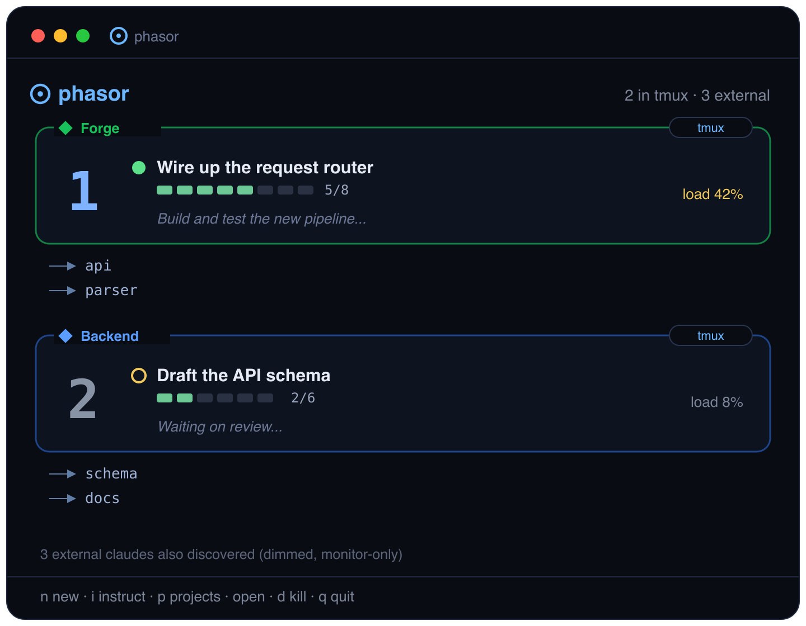
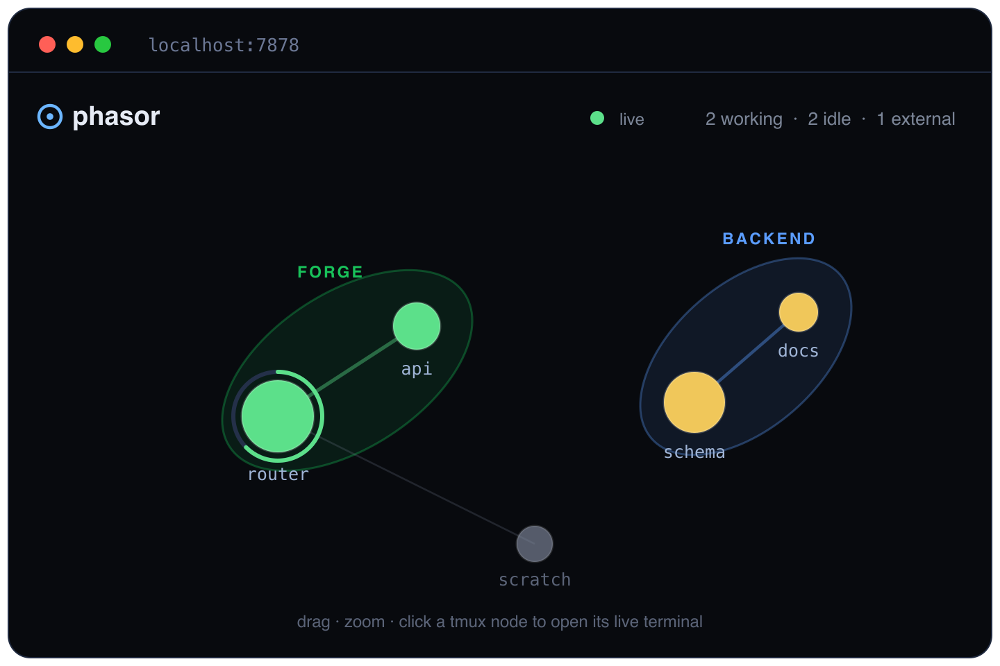

# ◍ phasor


**[Landing page](https://interpretica-io.github.io/phasor/)** ·
**[GitHub](https://github.com/interpretica-io/phasor)**

A terminal dashboard that monitors and orchestrates **every** running Claude
Code agent on your machine. Phasor auto-discovers all `claude` CLI processes and
shows each as a live node — its title, the directories it's touching, todo
progress, status, activity load, and most recent phrase.

Each running agent is its **own** node (phasor does **not** collapse several
claudes in the same folder into one). Agents you launch from phasor run in its
own tmux session and can be **opened** — the dashboard hands the screen over to
that agent's terminal. Claudes started elsewhere (a plain iTerm tab, etc.) are
still discovered and monitored, but shown **dimmed/grey** and marked
`[external]` — they aren't in tmux, so they can't be opened, only watched.

Each agent is a compact rounded card, spread across the screen, with solid
line-drawn arrows fanning out to the folders it has touched (names only).

```
◍ phasor  1 in tmux · 6 external

 ╭ ◆ Forge ───────────────────────────╮
 │┏━┓  ● Analyze the build pipeline now│
 │┗━┓  ▰▰▰▰▰▱ 5/8                  ⚡42%│
 │┗━┛  Build and test:…                │
 ╰───┬────────────────────────────────╯
     ├──▶ api
     ├──▶ parser
     ╰──▶ runtime
```

The big seven-segment number on the left is the **quick-jump key** (press it to
select). `●` (green) = openable agent working in phasor's tmux, `○` (amber) =
idle; an external claude you can only monitor is dimmed grey. Each card has a
progress bar (filled from the agent's todo list, empty when unknown) and an
**activity load** `⚡N%` — how hard the agent is working, derived from how fast
its transcript is growing (sampled every second). When the agent's cwd belongs
to a configured **project**, the card border is tinted in that project's colour
and tagged with a `◆ name` chip (see [Projects](#projects)). Arrows point to
folder **names**, never full paths. The selected card is highlighted.

**Task-completion highlight.** When an agent finishes a task (a final
`end_turn` answer), the TUI marks it with a red stripe down the right edge for
3 s, and the web node celebrates with a burst + a pop tinted to the hue of that
last answer, then settles back.

## Mockups

> Representative mockups, not live captures.

The terminal dashboard — one card per agent, project-tinted, with progress,
activity load and the folders each is touching:



The browser dashboard (`phasor serve`) — the same agents as a force-directed
graph, clustered and wrapped in per-project contours:



## Requirements

- `tmux` on `PATH`
- `claude` (Claude Code CLI) on `PATH`
- Rust toolchain (to build)

## Platform support

**macOS** and **Linux** — these are the supported platforms (CI builds and
tests both). phasor relies on tmux, `ps`/`lsof` and a few POSIX bits, so it does
not run natively on **Windows**; use **WSL2** there.

## Install

**Homebrew** (builds from source; pulls in Rust + tmux automatically):

```sh
brew install --HEAD interpretica-io/tap/phasor   # latest from main
# brew install interpretica-io/tap/phasor        # once a release is tagged + the formula's sha256 is set
```

**With Cargo:**

```sh
cargo install --git https://github.com/interpretica-io/phasor
```

## Build & run

```sh
cargo build --release
./target/release/phasor
```

### Keys

| key        | action                                              |
|------------|-----------------------------------------------------|
| `n`        | new agent — prompts for a working directory         |
| `i`        | queue an **auto-instruction** for the selected agent (sent when it next finishes) |
| `p`        | edit the **projects** config (`~/.phasor/projects.json`) in `$EDITOR` |
| `1`-`9`,`0`| jump to (select) that numbered agent — does not open |
| `←↑↓→` / `hjkl` | move selection around the grid                  |
| `Enter`    | open the selected agent's terminal (tmux attach)    |
| click      | select **and** open that agent                      |
| `d`        | kill the selected agent's window                    |
| `q`        | quit the dashboard (agents keep running in tmux)    |

Inside an agent's terminal, press **`Ctrl-Q`** to jump back to the dashboard
(phasor binds this on its own tmux server, so no prefix is needed). The
classic tmux **prefix + d** (default `Ctrl-b` `d`) also works. A reminder is
shown in the tmux status bar at the bottom while you're attached. Agents
survive across dashboard restarts — they live in a dedicated tmux server
(`tmux -L phasor`). Set `PHASOR_SOCKET` / `PHASOR_SESSION` to run an isolated
instance on a different socket (handy for testing without disturbing your live
agents).

## Projects

Phasor can group agents into **projects** defined in `~/.phasor/projects.json` —
a JSON array of `{ name, prefix, color }`:

```json
[
  { "name": "Backend", "prefix": "/home/you/src/acme/backend", "color": "#1f6bff" },
  { "name": "Acme",    "prefix": "/home/you/src/acme",         "color": "#10ad22" }
]
```

Any agent whose working directory is **under a project's prefix** is labelled
with that project's name and tinted with its colour (the **longest** matching
prefix wins, so nested projects work). In the TUI the card border takes the
colour and a `◆ name` chip; in the web graph the project's agents are wrapped in
a coloured contour labelled with the project name, and their links share the
colour.

Projects are **editable from both interfaces**:

- **TUI** — press `p` to open `~/.phasor/projects.json` in `$EDITOR` (a starter
  example is seeded if the file doesn't exist). Changes apply within a few
  seconds.
- **Web** — click **`◆ projects`** in the header for a small editor (name /
  prefix / colour-picker rows, add & delete, **save**).

Both read and write the same file via the scanner, so a change in one shows up
in the other.

## Auto-instructions

You can queue an instruction to be **sent automatically when an agent next
finishes its turn** — useful for chaining "now do X" without babysitting.

- **TUI** — select an agent and press `i`, type the instruction, `Enter`.
- **Web** — right-click a `⧉ tmux` node (or click its `✎` icon).

A queued instruction shows as a **`↻`** marker on the card / node. It is sent
each time the agent finishes a turn and **repeats** — phasor appends
*"but if you really finished the task, write 'FINISHED COMPLETELY'"* to the
prompt, and once the agent's answer contains that sentinel the instruction is
cleared and no longer re-sent. (Only `⧉ tmux` agents can be instructed; external
claudes are monitor-only.)

## Web dashboard

```sh
phasor serve            # http://127.0.0.1:7878
phasor serve 9000       # custom port
```

A parallel **graphical dashboard in the browser**, backed by the exact same
discovery as the TUI (shared `scan` module) and served by **axum**. Built for a
big screen / wall display: a live **force-directed graph** (D3.js) — every agent
is a glowing node whose size grows with its activity load, colour shows status
(green working / amber idle / grey external), with a progress ring and a
breathing pulse while working; the folders it touches hang beneath it in a
column. Agents that **share working folders** are pulled into clusters and
linked by thin lines (brighter/thicker the more folders they share); each
cluster — or **project** (see above) — is wrapped in its own soft **contour**,
non-overlapping, so you can see at a glance who's working on related code.
Drag to rearrange, scroll to zoom, hover for details, and click a
`⧉ tmux` node to open its live terminal. Finishing a task makes the node burst.
A slim header shows live working/idle/external counters. Auto-refreshes every
1.5 s; JSON API at `/api/agents`, projects at `/api/projects`.

**Adaptive theme.** The page follows your OS light/dark preference by default;
the header button cycles auto → light → dark and remembers your choice. The
in-browser terminal recolors to match.

**Live terminals in the browser.** Click an openable `⧉ tmux` agent and its
terminal opens right in the page via [xterm.js](https://xtermjs.org) over a
WebSocket bridged to a PTY running `tmux attach`. Type, resize, the lot. Close
the overlay (or `Ctrl-Q` / prefix + d inside) to detach; the agent keeps
running. The server binds `127.0.0.1` only — a browser terminal is full shell
access, so it stays local.

## Spawning agents from outside

```sh
cd /path/to/project
phasor exec claude --dangerously-skip-permissions
```

Everything after `exec` is run as a command in a **new tmux window** of the
phasor session, in the current directory, and then the CLI exits. The window
shows up in the dashboard as an openable `⧉ tmux` agent. Use it from scripts or
other tools to seed phasor-managed terminals. Arguments are preserved, so
compound commands work too: `phasor exec bash -lc 'cd sub && claude'`.

`start` launches the **dashboard opened straight into the new window**, so
you watch the command immediately:

```sh
cd /path/to/project
phasor start claude
```

Press **`Ctrl-Q`** (or tmux prefix + d) to **collapse** the terminal — you drop
into the phasor dashboard, where the command is now a card. Select it and press
`Enter` (or click) to re-open ("maximize") it. `q` quits the dashboard; the
command keeps running in the phasor session.

## Save & restore

tmux keeps your agents alive across phasor restarts, but **not** across a reboot
or `tmux kill-server`. Snapshot the managed agents and bring them back later:

```sh
phasor save           # → ~/.phasor/session.json  (cwd + claude session id each)
phasor restore        # recreate a window per saved agent, resuming each session
```

`save` records every agent with a resolvable session — both phasor-managed
agents **and external claudes** you started in a plain terminal (their session
id is read from the transcript). `restore` opens one tmux window per entry and
**resumes** that claude session — the on-disk transcript is reused, so the
conversations come back, not just empty terminals. Restored agents (including
the formerly external ones) come back as **managed** phasor windows. A session
that's already open is skipped (restore is idempotent), and a saved directory
that no longer exists is left out. Both accept an optional file path to use
instead of the default.

## Diagnostics

```sh
phasor doctor [cwd]
```

Prints the current phasor tmux windows and parses the most recent Claude
transcript for `cwd`, showing the title, status, todos, detected directories
and recent phrases — handy for debugging transcript resolution.

```sh
phasor render [WIDTHxHEIGHT]   # render one TUI frame to stdout as plain text
```

## How it works

| concern              | mechanism                                                            |
|----------------------|----------------------------------------------------------------------|
| discovery            | `ps` for processes named `claude`, cwds resolved via one batched `lsof` |
| agent identity       | one node per phasor tmux window **and** per external claude — never grouped by folder |
| openable vs external | a window phasor manages is openable; claudes started elsewhere are dimmed, monitor-only |
| projects             | `~/.phasor/projects.json` maps a directory prefix → name + colour (longest match wins) |
| auto-instructions    | queued text auto-sent on completion; repeats until the answer says `FINISHED COMPLETELY` |
| live terminal view   | tmux attach (TUI) / a WebSocket→PTY `tmux attach` bridge (web)        |
| state / progress     | tails `~/.claude/projects/<encoded-cwd>/<session>.jsonl`             |
| working folders      | `cwd` + file paths from mutating tools + `/add-dir` directories      |
| progress             | latest `TodoWrite` → completed / total                              |
| last phrases         | most recent assistant `text` blocks                                  |
| status               | `working` if the transcript changed in the last 20 s, else `idle`    |
| per-window identity  | each window gets a `--session-id` + `@phasor_session` option so it maps to its exact transcript |
| web server           | axum + hyper on tokio; PTY I/O on dedicated threads bridged over channels |

Discovery, transcript parsing and activity sampling run on a background thread
that streams agent snapshots to the UI over a channel — the dashboard never
blocks on `tmux`/`ps`/disk.

### Module map

```
src/
├── main.rs            CLI dispatch, event loop, terminal setup, attach, $EDITOR, doctor, render
├── app.rs             TUI app state, key/mouse handling, scanner updates
├── agent.rs           Agent (one window/process) + AgentState + Status models
├── scan.rs            shared discovery: build agents, reparse transcripts, auto-send instructions
├── discover.rs        ps + lsof discovery of all running claude processes
├── transcript.rs      cwd→dir encoding, session resolution, JSONL parsing
├── tmux.rs            tmux CLI wrapper (socket/session/window/attach/options)
├── config.rs          ~/.phasor/projects.json load/save + prefix matching
├── server.rs          axum web server: JSON API + WebSocket↔PTY bridge
├── server_index.html  the browser dashboard (D3 force graph, xterm.js, editors)
└── ui/
    ├── mod.rs         ratatui rendering: header, status bar, input popups, hit-testing
    └── galaxy.rs      the node-field cards: big numbers, progress, folder arrows, project chips
```

## Status / roadmap

Working today: launch agents, per-agent live cards with auto-detected
work-dirs, progress, phrases, status and activity load, click-to-open, kill,
projects (prefix→name+colour, editable in both UIs), queued auto-instructions,
a browser dashboard with live terminals, and `save`/`restore` of sessions
across reboots.

Planned: in-panel terminal preview (`capture-pane`), adopting pre-existing
phasor windows on startup.
